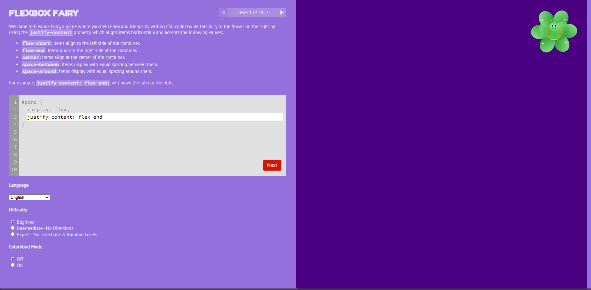

# Flexbox Fairy

An interactive browser-based game for learning CSS Flexbox, built as a multi-page dashboard application. Players write real CSS to position fairies onto matching flowers, advancing through 24 progressively challenging levels that cover the full flexbox specification.



---

## Architecture

The application follows a **single-page application (SPA)** pattern driven by vanilla JavaScript and jQuery. Three logical views — **Game**, **Progress**, and **Reference** — are rendered as sibling DOM nodes whose visibility is toggled via CSS classes (`.page` / `.page.active`). No routing library or build step is required; the project runs directly from the file system or any static HTTP server.

```
index.html              ← shell: topnav + stats-bar + three .page panels
css/style.css           ← all styles (base + dashboard extensions)
js/
  levels.js             ← level data: board layout, CSS selector, before/after snippets
  docs.js               ← per-property documentation strings (multi-language)
  messages.js           ← UI string translations (50+ locales)
  game.js               ← core game engine (level loading, CSS evaluation, win detection)
  dashboard.js          ← page switching, stats bar, progress map, reference cards
images/                 ← SVG sprites for fairies, flowers, and colourblind variants
node_modules/
  jquery/               ← DOM manipulation & event handling
  animate.css/          ← CSS keyframe animation library
```

---

## HTML Elements Used

| Element | Role |
|---|---|
| `<nav>` | Top navigation bar (`#topnav`) — landmark for accessibility |
| `<div>` | Layout containers: `#stats-bar`, `#dashboard`, `.page`, `.dash-card`, etc. |
| `<button>` | Nav tabs (`.nav-tab`), settings trigger (`#labelSettings`), next-level action (`#next`) |
| `<select>` | Language selector (`#language`) — 50+ locale options |
| `<option>` | Individual language entries inside `#language` |
| `<section>` | Semantic grouping: game sidebar (`#sidebar`), game board view (`#view`), settings groups |
| `<form>` | Difficulty (`#difficulty`) and colorblind-mode (`#colorblind`) radio groups |
| `<input type="radio">` | Difficulty level and colorblind-mode toggle controls |
| `<label>` | Accessible labels for every radio input |
| `<textarea>` | Live CSS code editor (`#code`) — single editable region per level |
| `<pre>` | Read-only code context blocks (`#before`, `#after`) surrounding the editable area |
| `<p>` | Level instruction text injected as `innerHTML` by `game.js` (`#instructions`) |
| `<span>` | Inline UI elements: level counter, navigation arrows (`.arrow`), triangle chevrons |
| `<h1>` – `<h4>` | Heading hierarchy: brand title (`.title`), section labels, settings headings |
| `<a>` | External links to related games in the win screen (`#share .games`) |
| `` | Game thumbnails in `#share`, nav logo (`.nav-logo`) |
| `<script>` | Inline and external JS: jQuery, game modules, analytics |
| `<link>` | Stylesheet imports: `animate.css`, Google Fonts, `style.css` |
| `<meta>` | Charset, viewport, Open Graph, and Twitter Card metadata |

---

## CSS Techniques & Properties

### Layout
| Technique | Where applied |
|---|---|
| `display: flex` | `body`, `#topnav`, `.header`, `.nav-tabs`, `#pond`, `#background`, `.stat-item`, `.ref-values`, `.level-grid-container`, `#stats-bar` |
| `flex-direction: column` | Body column stack (nav → stats → dashboard); `.stat-card`; mobile game page |
| `flex-direction: row` | `#page-game` sidebar/board split; `.nav-tabs` |
| `flex-wrap: wrap` | `.games`, `#levels`, `.ref-grid`, `.level-grid-container`, `.ref-values`, `.stat-cards-row` |
| `justify-content` | Space distribution across nav, header, and grid rows |
| `align-items` | Cross-axis centering in nav bar, stats bar, and card rows |
| `flex: 1` | `#dashboard` grows to fill remaining viewport height |
| `gap` | Consistent spacing in flex and grid containers |
| `display: grid` | `.stat-cards-row` (auto-fit columns), `.ref-grid` (auto-fill columns) |
| `grid-template-columns: repeat(auto-fill, minmax(..., 1fr))` | Responsive reference card grid |
| `position: sticky` | `#topnav` (stays at top of viewport on scroll); `#board` (keeps game visible) |
| `position: absolute` | Tooltip overlays (`.tooltip`, `#settings .tooltip`) |
| `position: relative` | Tooltip anchor containers |
| `overflow: hidden` | `#page-game`, `#css`, `#board`, `.fairy`, `.flower` |
| `overflow-y: auto` | `#page-game #sidebar`, `#page-progress`, `#page-reference` |
| `calc()` | `.page` height: `calc(100vh - var(--nav-height) - var(--stats-height))` |
| CSS custom properties (`--*`) | `--nav-height`, `--stats-height`, `--header-total` — centralised layout constants in `:root` |

### Visual
| Technique | Where applied |
|---|---|
| `background: linear-gradient(...)` | `#stats-progress-fill` — animated progress bar |
| `border-radius` | Cards, chips, buttons, badges, level circles, board |
| `box-sizing: border-box` | Global reset (`*`) |
| `transition` | Button hover, progress fill width, nav tab colour |
| `opacity` | Disabled-state indicators (`.disabled`) |
| `background-size: contain / cover` | SVG sprite scaling inside `.fairy .bg` and `.flower .bg` |
| `background-image: url(...)` | Per-colour SVG sprites for fairies and flowers |
| `::after` pseudo-element | Tooltip arrow carets; game-thumbnail overlay tint |
| `::view-transition-*` | Smooth animated transitions between level states (View Transitions API) |
| `direction: rtl` | Right-to-left text support for Arabic, Farsi, and Hebrew |
| `user-select: none` | Prevents text selection on interactive controls |

### Responsive
| Breakpoint | Behaviour |
|---|---|
| `max-width: 767px` | Nav labels hidden (icon-only tabs); game page reverses to `column-reverse` (board above editor); stat labels hidden; grid collapses to two columns |

---

## JavaScript APIs & Patterns

### Core browser APIs
| API | Usage |
|---|---|
| `localStorage` | Persists `level`, `answers`, `solved`, and `colorblind` preferences across sessions |
| `document.startViewTransition()` | Animates fairy positions between CSS states during `game.check()` |
| `MutationObserver` | Watches `.level-marker` class mutations to trigger live stats-bar updates without modifying `game.js` |
| `window.location.hash` | Language routing — the selected locale is encoded as the URL hash fragment |
| `window.navigator.language` | Auto-detects the user's preferred locale on first visit |
| `confirm()` | Modal confirmation before the Reset action in `game.js` |

### jQuery patterns
| Pattern | Usage |
|---|---|
| `.on('input', debounce(...))` | Debounced CSS evaluation on keystroke to avoid excessive DOM comparisons |
| `.position()` | Pixel-level position comparison between `.fairy` and `.flower` elements to determine correctness |
| `.css(...)` | Dynamic inline style injection when loading level board styles and applying player CSS |
| `.addClass()` / `.removeClass()` | State machine transitions: `disabled`, `solved`, `current`, `animated`, `active` |
| `$(document).ready()` | Bootstraps both `game.start()` and `dashboard.init()` |
| `$.inArray()` | Checks solved-level membership in `game.solved` array |

### Game engine patterns
| Pattern | Description |
|---|---|
| Debounce | `game.debounce(fn, 500)` delays CSS evaluation until 500 ms after the last keystroke |
| Position comparison | Fairy elements are evaluated by `$(el).position()` and compared as JSON-serialised coordinate keys against flower positions |
| Level data schema | Each level in `levels.js` carries `name`, `instructions` (multi-language), `before`/`after` code snippets, `board` string, `style` object, and optional `selector` / `classes` overrides |
| i18n | All UI strings are looked up in `messages.js` and `docs.js` via the two-letter BCP-47 language code stored in `game.language`, with `en` as the fallback |

---

## Getting Started

```bash
npm install          # installs jQuery and animate.css into node_modules/
# then open index.html in a browser (no build step required)
```

> A local HTTP server (e.g. `npx serve .`) is recommended to avoid `file://` CORS restrictions when loading SVG assets.

---

## Author

Thomas Park

* [Twitter](https://twitter.com/thomashpark)
* [Homepage](https://thomaspark.co)
* [GitHub](https://github.com/thomaspark)

## Translators

My gratitude to these contributors for localizing Flexbox Froggy. This is what open source is all about.

* Afrikaans by [Andrea Zonnekus](https://github.com/andreazonnekus)
* Arabic by [Mahmoud Al-Omoush](https://github.com/m7modg97)
* Azerbaijani by [jalalbmnf](https://github.com/jalalbmnf)
* Bengali by [Ayemun Hossain](https://github.com/AyemunHossain)
* Bosnian by [Haris Hamzić](https://github.com/hamzic2019)
* Bulgarian by [Mihail Gaberov](https://github.com/mihailgaberov)
* Burmese by [Si Thu Hlaing](https://github.com/sithulaing)
* Catalan by [Xavier Gaya](https://github.com/xavigaya)
* Chinese Simplified by [Tim Guo](https://github.com/timguoqk)
* Chinese Traditional by [sunsheeppoplar](https://github.com/sunsheeppoplar)
* Croatian by [diomed](https://github.com/diomed)
* Danish by [Frederik Jacobsen](https://github.com/fkj)
* Dutch by [Peter Vermeulen](https://github.com/peterver)
* Czech by [Ondřej Hruška](https://github.com/MightyPork)
* Esperanto by [Harvey Stroud](https://github.com/harveystroud)
* Estonian by [Sten Orasmäe](https://github.com/sten9911)
* Farsi by [Ali Haddad](https://github.com/alihaddadkar)
* Finnish by [Minna N.](https://github.com/minna-xD)
* French by [Karl Thibault](https://github.com/Notuom)
* Galician by [Pilar Mera](https://github.com/decrecementofeliz)
* German by [Thorsten Frommen](https://github.com/tfrommen)
* Greek by [lmintmate](https://github.com/lmintmate)
* Gujarati by [Harshhh](https://github.com/ozaharsh95)
* Hebrew by [Omri Attiya](https://github.com/omriattiya)
* Hindi by [Shubham Pandey](https://github.com/shubham9411)
* Hungarian by [Adam Graf](https://github.com/netgrafe)
* Indonesian by [gabesx](https://github.com/gabesx)
* Italian by [Matteo Bandiera](https://github.com/matteobandiera)
* Japanese by [Ginpei](https://github.com/ginpei)
* Korean by [Meen Chul Kim](https://github.com/liberaliscomputing)
* Latvian by [Arturs Kirtovskis](https://github.com/akirtovskis)
* Lithuanian by [Justas Maziliauskas](https://github.com/justutiz)
* Macedonian by [David Timovski](https://github.com/davidtimovski)
* Malayalam by [Agney Menon](https://github.com/BoyWithSilverWings)
* Mongolian by [Turuu](https://github.com/TuruuDo)
* Nepali by [Kamal Ale Magar](https://github.com/KamalAle12)
* Norwegian by [Melroy Dsouza](https://github.com/dsouzamelroy2007)
* Polish by [eLGi](https://github.com/eLGi)
* Portuguese by [Marcus Tenório](https://github.com/mvtenorio)
* Romanian by [Vlad](https://github.com/pckltr)
* Russian by [Artyom Vozhzhov](https://github.com/artem328)
* Serbian by [Danko Milutinovic](https://github.com/dankoknad)
* Sinhala by [Nirmal Chamika](https://github.com/NimaChamika)
* Slovak by [Joe Henthorn](https://github.com/jjhen99)
* Spanish by [Manuel González](https://github.com/manuelitox)
* Swedish by [Martin Ohlson](https://github.com/martinkrulltott)
* Tamil by [Galeel Bhasha](https://github.com/gbhasha)
* Telugu by [Sai Venkat Balabadruni](https://github.com/Thunderbolt2-o)
* Thai by [Anurat Chapanond](https://github.com/anurat)
* Turkish by [Uğur Korfalı](https://github.com/kel-sakal-biyik)
* Ukrainian by [sHa](https://github.com/shadoll)
* Vietnamese by [Kingsten Banh](https://github.com/kingstenbanh)
* Yoruba by [Oluwafisayomi Balogun](https://github.com/oluwafisayomi-balogun)

Don't see your language on the list? Contribute a translation! Fork the [repo](https://github.com/thomaspark/flexboxfroggy/), add your translations, and submit a pull request.

## Copyright and License

Copyright 2015-2023 Thomas Park. Code released under [the MIT License](https://github.com/thomaspark/flexboxfroggy/blob/gh-pages/LICENSE). Images released under [Creative Commons](https://creativecommons.org/licenses/by/3.0/legalcode.txt).
